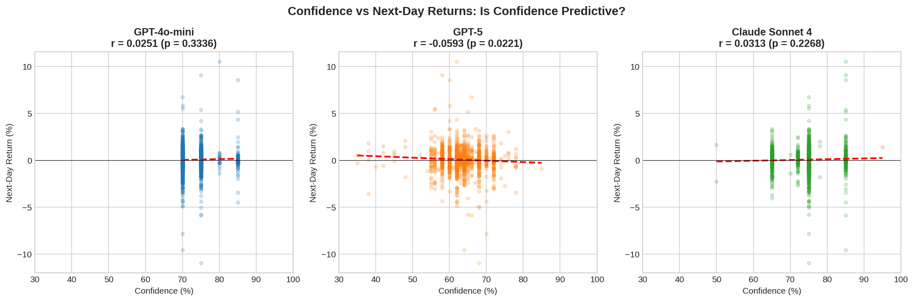

# Knowledge Without Wisdom
LLMs show strong market knowledge but fail as trading agents. This repo tests GPT-4o-mini, GPT-5 and Claude Sonnet 4 across 4k+ SPY decisions and finds that confidence scores are miscalibrated and contain no tradable signal.


## 🎯 Key Finding

> **LLMs can possess perfect historical knowledge of market events but fundamentally cannot convert this knowledge into profitable trading decisions.**

We tested three frontier LLMs (GPT-4o-mini, GPT-5, Claude Sonnet 4) as autonomous trading agents across 1,489 trading days. Despite GPT-5 and Claude having explicit training data covering 2024 market events:

- **All models produced negative alpha** (mean: -10.89%)
- **Zero correlation** between model confidence and returns (r = -0.001)
- **Two distinct failure modes** identified: Behavioral Paralysis vs. Permabull Bias

## 📊 Results Summary

| Model | Period | Alpha | Hold % | Buys | Sells | Failure Mode |
|-------|--------|-------|--------|------|-------|--------------|
| GPT-4o-mini | In-Training | -33.08% | 87.4% | 103 | 24 | Paralysis |
| GPT-4o-mini | Out-of-Training | -11.17% | 96.5% | 17 | 0 | Paralysis |
| GPT-5 | In-Training | -10.75% | 51.9% | 485 | **0** | Permabull |
| GPT-5 | Out-of-Training | -3.52% | 49.1% | 245 | **0** | Permabull |
| Claude Sonnet 4 | In-Training | -3.31% | 48.2% | 522 | **0** | Permabull |
| Claude Sonnet 4 | Out-of-Training | -3.52% | 49.5% | 243 | **0** | Permabull |

### The "Permabull Trap" 🐂

GPT-5 and Claude appear "active" with ~50% BUY rates, but they generate **zero SELL signals**. They effectively:
1. Buy on Day 1
2. Repeatedly signal BUY (ignored because already long)
3. Never exit
4. Become accidental index trackers with delayed entry

Their "knowledge" of 2024 market gains manifests as trend confirmation bias ("stocks go up") rather than strategic timing.

## 🔬 Confidence Analysis



We found that LLM confidence scores are completely meaningless for trading:

| Analysis | Result | Implication |
|----------|--------|-------------|
| Confidence-Return Correlation | r = -0.001 | No predictive power |
| Confidence-Weighted Sizing | -53% degradation | Makes losses worse |
| Average Confidence | 70.5% | High confidence, negative skill |

We term this **"Confident Incompetence"** — models are confidently wrong.

## 🚀 Quick Start


### Set API Keys

```bash
export OPENAI_API_KEY="your-key-here"
export ANTHROPIC_API_KEY="your-key-here"
```


## 📈 Reproducing Results

### Requirements

- Python 3.9+
- OpenAI API key (for GPT-4o-mini and GPT-5)
- Anthropic API key (for Claude Sonnet 4)
- ~$10-15 in API credits for full experiment

### API Rate Limits Used

| Model | Rate Limit | Concurrent Workers |
|-------|------------|-------------------|
| GPT-4o-mini | 400 RPM | 20 |
| GPT-5 | 150 RPM | 10 |
| Claude Sonnet 4 | 40 RPM | 5 |

### Estimated Runtime

| Model | Time |
|-------|------|
| GPT-4o-mini | ~4 min |
| GPT-5 | ~16 min |
| Claude Sonnet 4 | ~38 min |
| **Total** | **~58 min** |


## 🔮 Future Directions

Based on our findings, future work should explore:

1. **Constrained Action Spaces**: Force market-neutral positions to break Permabull bias
2. **Explicit Exit Rules**: Require models to output SELL signals periodically
3. **Relative Ranking**: "Which stock is best?" instead of "Buy/Sell/Hold?"
4. **Probabilistic Outputs**: Expected return distributions instead of discrete actions
5. **Multi-Agent Approaches**: Use LLMs for signal generation in larger systems

## ⚠️ Disclaimer

This research is for academic purposes only. The results demonstrate that LLMs should **not** be used for autonomous trading decisions. Past performance does not guarantee future results. Trading involves substantial risk of loss.

## 📄 License

MIT License - see [LICENSE](LICENSE) for details.


---

**Key Takeaway**: *LLMs are semantic search engines for trend, not strategic agents for value. They can identify patterns but cannot determine if those patterns offer positive expected value.*
